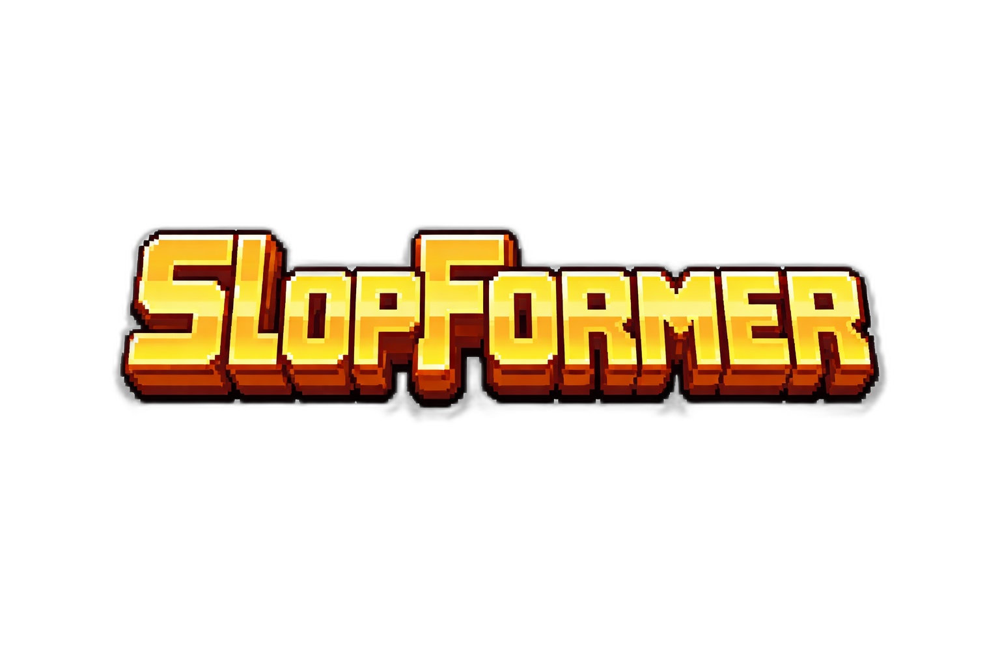

<p align="center">
  
</p>

<p align="center">
  <a href="https://hgosansn.github.io/slopformer/">
    
  </a>
  <a href="https://github.com/hgosansn/slopformer">
    
  </a>
  <a href="https://github.com/hgosansn/slopformer/commits/main">
    
  </a>
</p>

# SlopFormer

SlopFormer is a sprite pipeline + web demo for building game-ready character animations from generated video and curated frames.

## Live Demo

- https://hgosansn.github.io/slopformer/

## What It Does

- Generates animation clips (local CogVideoX or external video source)
- Extracts frames at controllable fps
- Lets you manually prune bad frames
- Removes backgrounds to transparent PNG
- Builds normalized spritesheets + metadata
- Previews characters in-browser with movement/jump logic

## Quick Start

```bash
# 1) extract frames from an animation clip
python3 extract_frames.py work/trex/jump.mp4 --character trex --fps 4

# 2) remove backgrounds
python3 remove_bg.py --character trex

# 3) refresh character metadata
python3 init_metadata.py --character trex --fps 4

# 4) build jump spritesheet
python3 build_spritesheet.py --character trex --animation jump --size 128
```

Then open `index.html`.

## Docs

- Pipeline details: [PIPELINE.md](PIPELINE.md)

## Deployment

GitHub Pages auto-deploys from `main` via `.github/workflows/pages.yml`.
